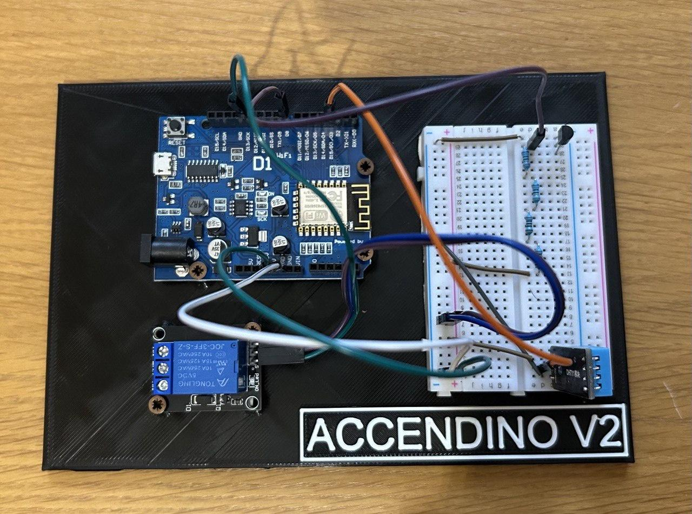

# accendino_v2
New version of accendino based on a Wemos D1 R1 with telegram bot and temperature sensor. I use it to control and switch the heating remotely with a Telegram bot.
## Main functions:
- Turn on and off multi‑fuel boiler with relay
- Check the puffer temperature (DS18B20 sensor)
- Check the garage temperature and humidity (DHT11 sensor)
- Check the level of the combustible in the tank (HC-SR04 ultrasonic sensor)

Telegram bot:

# Changelog
- v1.1 New version of accendino with telegram bot and temperature sensor
- v1.2 Added messagge after power loss
- v1.5 Replaced CTBot with AsyncTelegram2
- v3.0 Added puffer temperature, HC-SR04 for tank level, fixed bugs with text messagges
